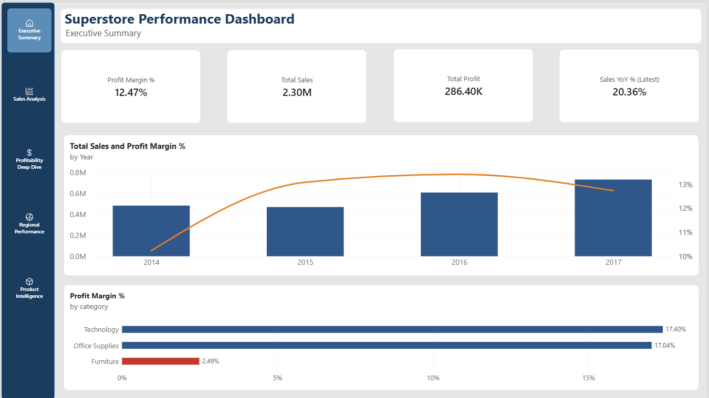
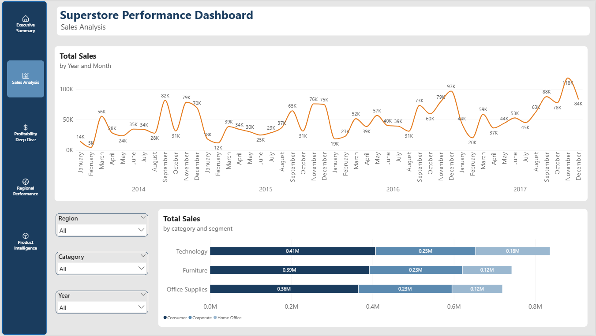
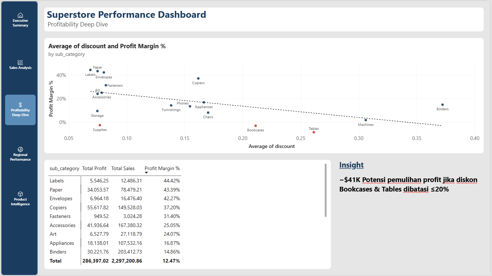
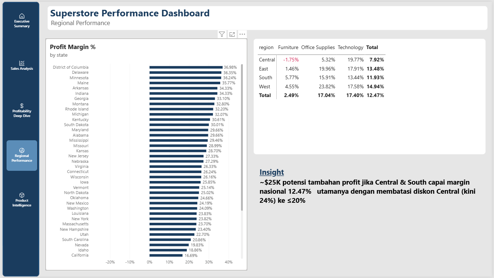
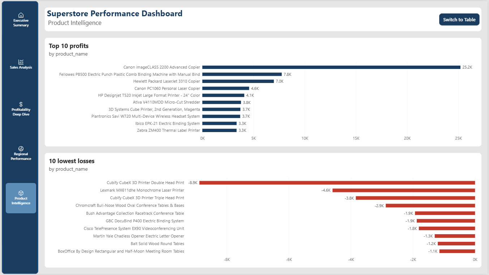
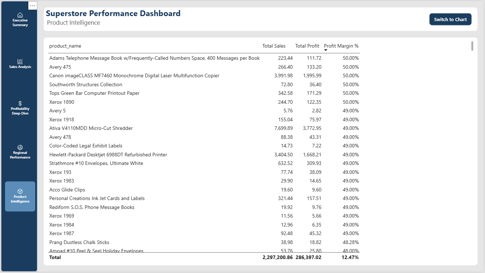
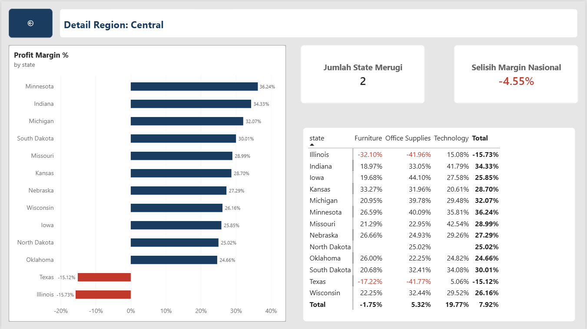

# Superstore Sales Analysis

Proyek analisis data *end-to-end* yang menggunakan **PostgreSQL** dan **Power BI** untuk menginvestigasi masalah profitabilitas pada data retail Superstore (2014-2017). Fokus analisis: **margin yang rapuh dan ketimpangan geografis**.

---

## Latar Belakang

Revenue Superstore tumbuh **51.41%** dari 2014 ke 2017, tetapi profit margin justru **tidak stabil** dan turun di tahun terakhir saat revenue tertinggi. Proyek ini menelusuri *kenapa* — dari level kategori, diskon, hingga region — dan mengukur potensi perbaikan finansialnya.

## Temuan Kunci

- **Akar masalah tunggal: diskon di atas 20%.** Pada diskon 20% margin masih sehat (11.82%); pada 30% sudah negatif (-10.05%). Sebanyak 13.94% transaksi berdiskon di atas batas ini dan merugi.
- **Central adalah region paling bermasalah** — satu-satunya region dengan rata-rata diskon melewati 20% (24.04%), menekan margin ke 7.92% (terendah nasional).
- **Furniture kategori paling rapuh** — margin hanya 2.49%; Central + Furniture adalah kombinasi terburuk (-1.75%).
- **Potensi perbaikan ~$41K + ~$25K** dari pembatasan diskon (Bookcases & Tables) dan pemulihan margin region (Central & South). *Catatan: angka ini adalah batas atas teoretis dengan asumsi volume konstan.*

Detail lengkap tujuh pertanyaan bisnis (query, hasil, insight, rekomendasi) ada di **[docs/analysis-findings.md](docs/analysis-findings.md)**.

## Tech Stack

| Tool | Penggunaan |
|------|------------|
| PostgreSQL | Ekstraksi & analisis data (7 business questions) |
| Power BI | Pemodelan data (star schema), DAX, visualisasi, fitur interaktif |

## Fitur Dashboard

Dashboard terdiri dari 5 halaman utama + 1 halaman *drillthrough*, dengan:

- **Star schema** — fact_orders + 4 dimensi (termasuk dim_date hasil DAX)
- **Sistem warna semantik** konsisten (biru = data utama, merah = rugi, oranye = tren)
- **Drillthrough** — klik region → halaman detail per-state dengan judul dinamis & KPI diagnostik
- **Bookmark toggle** — beralih antara tampilan chart dan tabel
- **Row-Level Security (RLS)** — pembatasan data per region (4 role)
- **Panel insight diagnostik** — rekomendasi konkret dengan estimasi dampak finansial

## Struktur Repository

```
superstore-sales-analysis/
├── README.md
├── sql/
│   └── queries.sql              # 7 business questions (query-only)
├── docs/
│   └── analysis-findings.md     # hasil & insight lengkap tiap BQ
└── dashboard/
    ├── superstore.pbix          # file Power BI
    └── screenshots/             # tangkapan layar tiap halaman
```

## Screenshots

### 1. Executive Summary


### 2. Sales Analysis


### 3. Profitability Deep Dive


### 4. Regional Performance


### 5. Product Intelligence


### Drillthrough — Region Detail


### Row-Level Security (View as Central Manager)


## Catatan Metodologi

Simulasi pada BQ #6 dan BQ #7 mengasumsikan **volume penjualan tetap** setelah perubahan harga/diskon. Dalam praktik, menurunkan diskon dapat menurunkan unit terjual (*price elasticity*), sehingga angka *potential recovery* dan *potential gain* merupakan **batas atas teoretis**, bukan jaminan hasil aktual.

## Data Source

Dataset Superstore — tersedia publik di [Kaggle](https://www.kaggle.com/).

## Author

**Muhammad Sawaluddin**
[LinkedIn](https://www.linkedin.com/in/muhammad-sawaluddin-a01257320) · [GitHub](https://github.com/muhsawaluddin81-netizen)
